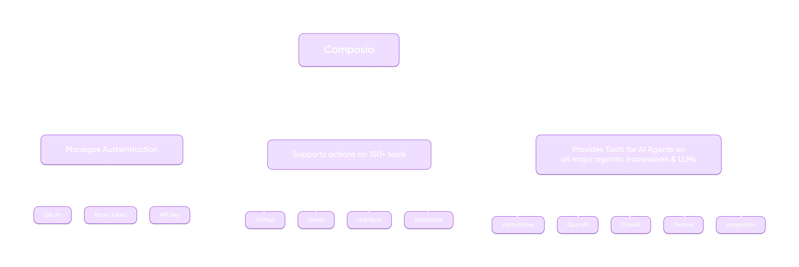
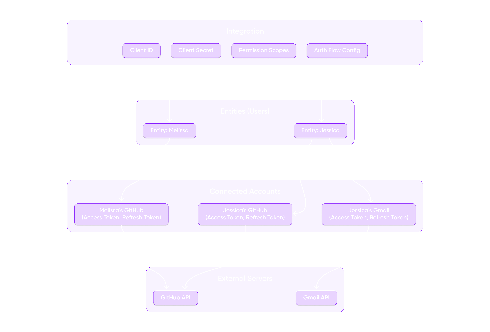
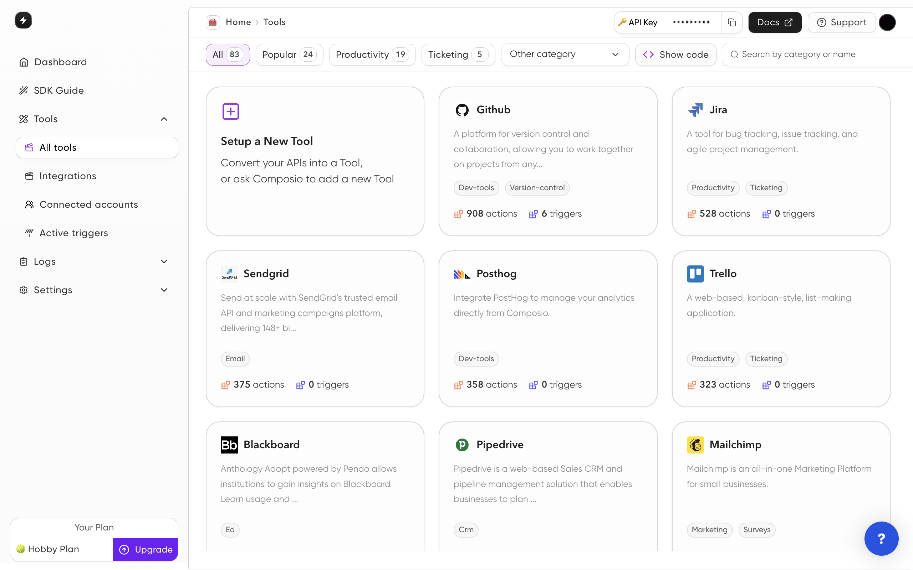

<p align="center">
  <a href="https://composio.dev//#gh-dark-mode-only">
    
  </a>
  <a href="https://composio.dev//#gh-light-mode-only">
    
  </a>
</p>

<h3 align="center">
Production Ready Toolset for Building Intelligent AI Agents
</h3>

<div align="center">

</div>

## 🎯 Overview

Composio is the ultimate toolset for integrating AI Agents with production-ready tools. Build powerful AI applications with 100+ pre-built integrations, multiple framework support, and enterprise-grade authentication management.

## ✨ Key Features

- **Extensive Tool Library**: 100+ integrations across Software, OS, Browser, Search, and Development categories
- **Framework Flexibility**: Compatible with OpenAI, Claude, LangChain, LlamaIndex, CrewAI and more
- **Enterprise Auth**: Built-in support for OAuth, API Keys, JWT, and other auth protocols
- **Superior Accuracy**: Up to 40% better agentic accuracy through optimized tool design
- **White-Label Ready**: Embed seamlessly in your applications
- **Extensible Architecture**: Easy to add new tools, frameworks, and auth protocols

## 🚀 Quick Start

Choose your preferred language to get started:

### Python
```shell
pip install composio-core
composio login
```

### JavaScript
```shell
npm install composio-core
```

### Authentication Flow


Composio handles Authentication for you
- Create an Integration for your external service (e.g., GitHub OAuth configuration)
- Users (Entities) use this Integration to connect their accounts
- Each successful connection creates a Connected Account
- Your application uses Connected Accounts to make authenticated requests
- You can also whitelabel the OAuth Developer app that is shown to the user when they initiate the connection

## 🛠️ Detailed Setup & Usage

### Python Integration

#### Installation
```shell
pip install composio-openai
```

#### Github Agent

```shell
composio add github
export OPENAI_API_KEY=sk-xxx
```
Let's start by building a simple agent that can interact with GitHub. Create a file `github_agent.py`:

```python
from composio_openai import ComposioToolSet, App
from openai import OpenAI

openai_client = OpenAI()
composio_toolset = ComposioToolSet()

tools = composio_toolset.get_tools(apps=[App.GITHUB])

task = "Star the repo composiohq/composio on GitHub"

response = openai_client.chat.completions.create(
model="gpt-4-turbo-preview",
tools=tools,
messages=
    [
        {"role": "system", "content": "You are a helpful assistant."},
        {"role": "user", "content": task},
    ],
)

result = composio_toolset.handle_tool_calls(response)
print(result)
```
#### Execute the Agent
```python
python github_agent.py
```

### Web Search Agent on Slack
```shell
composio add serpapi
composio add slack
export OPENAI_API_KEY=sk-xxx
```
Let's start by building a simple agent that can search the Web and reply on Slack. Create a file `slack_agent.py`:

```python
from composio_openai import ComposioToolSet, App
from openai import OpenAI

openai_client = OpenAI()
composio_toolset = ComposioToolSet()

tools = composio_toolset.get_tools(apps=[App.SLACK, App.SERPAPI])

task = "Find the top 5 performing stocks currently and tell me on my slack general channel"

response = openai_client.chat.completions.create(
model="gpt-4-turbo-preview",
tools=tools,
messages=
    [
        {"role": "system", "content": "You are a helpful assistant."},
        {"role": "user", "content": task},
    ],
)

result = composio_toolset.handle_tool_calls(response)
print(result)
```
### Execute the Agent
```python
python slack_agent.py
```


#### More Examples
Check out our [Python examples directory](https://github.com/ComposioHQ/composio/tree/master/python/examples) for more advanced use cases.

### JavaScript Integration

#### Installation
```shell
npm install composio-core openai
export OPENAI_API_KEY=sk-xxx
export COMPOSIO_API_KEY=xxx
```
Let's start by building a simple agent that can interact with Google Calendar. Create a file `calendar_agent.js`:

```javascript
import { OpenAI } from "openai";
import { OpenAIToolSet } from "composio-core";

const toolset = new OpenAIToolSet({
    apiKey: process.env.COMPOSIO_API_KEY,
});

async function executeAgent(entityName) {
    const entity = await toolset.client.getEntity(entityName)

    const tools = await toolset.get_actions({ actions: ["GOOGLECALENDAR_QUICK_ADD"] }, entity.id);
    const date = new Date();
    const instruction = "Today's date is ${date}. Schedule an event of 1 hour tomorrow at 5:30PM"

    const client = new OpenAI({ apiKey: process.env.OPENAI_API_KEY })
    const response = await client.chat.completions.create({
        model: "gpt-4-turbo",
        messages: [{
            role: "user",
            content: instruction,
        }],
        tools: tools,
        tool_choice: "auto",
    })

    console.log(response.choices[0].message.tool_calls);
    await toolset.handle_tool_call(response, entity.id);
}
```
#### Execute the Agent
```shell
node calendar_agent.js
```

### Web Search Agent on Slack

```shell
npm install composio-core openai
export OPENAI_API_KEY=sk-xxx
export COMPOSIO_API_KEY=xxx
```
Let's start by building a simple agent that can search the Web and reply on Slack. Create a file `slack_agent.js`:

```javascript
import { OpenAI } from "openai";
import { OpenAIToolSet } from "composio-core";

const toolset = new OpenAIToolSet({
    apiKey: process.env.COMPOSIO_API_KEY,
});

async function executeAgent(entityName) {
    const entity = await toolset.client.getEntity(entityName)

    const tools = await toolset.get_actions({ actions: ["SERPAPI_SEARCH","SLACK_SENDS_A_MESSAGE_TO_A_SLACK_CHANNEL"] }, entity.id);
    const date = new Date();
    const instruction = "Find the top 5 performing stocks currently and tell me on my slack general channel";

    const client = new OpenAI({ apiKey: process.env.OPENAI_API_KEY })
    const response = await client.chat.completions.create({
        model: "gpt-4-turbo",
        messages: [{
            role: "user",
            content: instruction,
        }],
        tools: tools,
        tool_choice: "auto",
    })

    console.log(response.choices[0].message.tool_calls);
    await toolset.handle_tool_call(response, entity.id);
}
```
### Execute the Agent
```python
node slack_agent.js
```

## 🔍 Dashboard & Monitoring



Our comprehensive dashboard enables:
- Integration management
- Workflow automation
- Detailed logging
- Advanced analytics

## 📖 Examples Library

- [Python Examples](https://github.com/ComposioHQ/composio/tree/master/python/examples/)

- [JavaScript Examples](https://github.com/ComposioHQ/composio/tree/master/js/examples/)


## 🤝 Community & Support

- [Documentation](https://docs.composio.dev)
- [Discord Community](https://dub.composio.dev/JoinHQ)
- [Twitter](https://twitter.com/composiohq)
- [YouTube Channel](https://www.youtube.com/@Composio)

## 🤗 Contributions

Composio is open-source and we welcome contributions. Please fork the repository, create a new branch for your feature, add your feature or improvement, and send a pull request.

Also go through our [Contribution Guidelines](https://github.com/composiodev/composio/blob/master/CONTRIBUTING.md) and [Code of Conduct](https://github.com/composiodev/composio/blob/master/CODE_OF_CONDUCT.md) before you start.

## 🔗 Links

- [Home page](https://composio.dev?utm_campaign=github-readme)
- [Contribution Guidelines](https://github.com/composiodev/composio/blob/master/CONTRIBUTING.md)
- [Docs](https://docs.composio.dev/?utm_campaign=github-readme)

## 🛡️ License

Composio is licensed under the Elastic License - see the [LICENSE](https://github.com/composiodev/composio/blob/master/LICENSE) file for details.

## 💪 Thanks To All Contributors

<a href="https://github.com/composiohq/composio/graphs/contributors">
  
</a>
